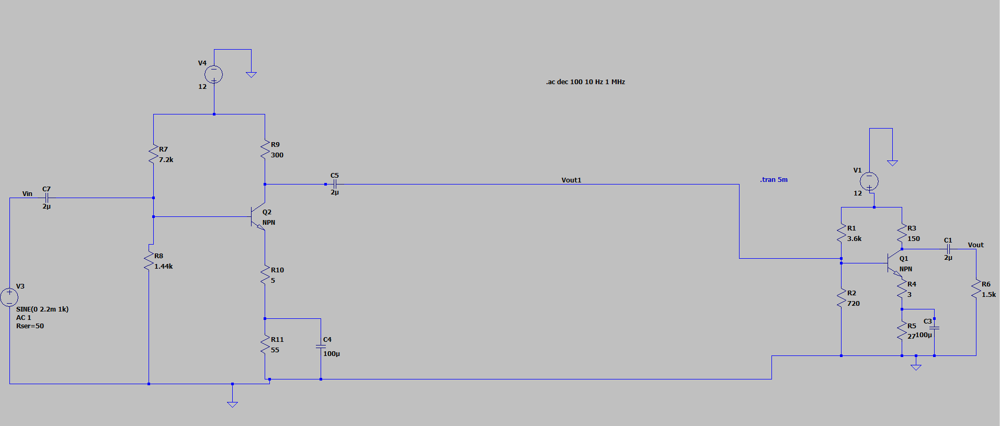

# Two-Stage-CE-Amplifier
Design and simulation of a two-stage BJT Common Emitter amplifier using LTspice.

# Two-Stage BJT Common Emitter Amplifier Design

## Overview
This project involves the design and simulation of a 2-stage Common Emitter (CE) amplifier aimed at achieving specific gain and bandwidth requirements.

## Specifications
- **Voltage Gain (Av):** 600
- **Supply Voltage (Vcc):** 12V
- **Transistor Model:** 2N2222

## Circuit Diagram
 
*(Note: Replace this with an actual schematic export if the current jpeg is just a gain plot)*

## How to Run the Simulation
1. Install [LTspice](https://www.analog.com/en/design-center/design-tools-and-calculators/ltspice-simulator.html).
2. Clone this repository: `git clone https://github.com/YOUR_USERNAME/Two-Stage-CE-Amplifier-Design.git`
3. Open `/Simulation/2-stage_CE_Amplifier.asc` in LTspice.
4. Press the **Run** (Running Man) icon to view the AC Analysis or Transient response.

## Results
The design achieved a total gain of 600. Detailed calculations can be found in `Documentation/CE_Amplifier_design_and_gain.pdf`.
